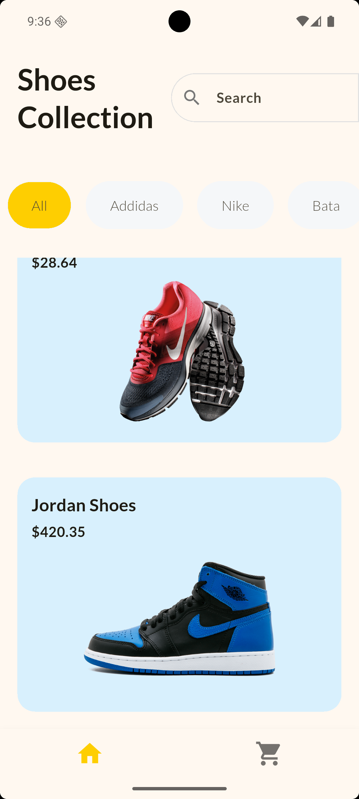
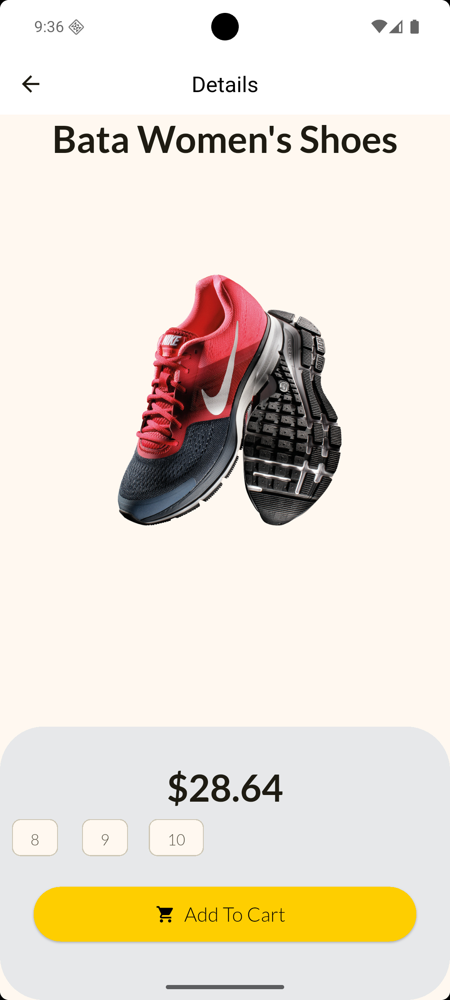
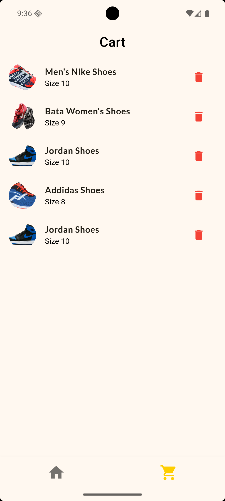

# 🛍️ Shop Sphere - Flutter E-Commerce App

Shop Sphere is a modern and responsive Flutter e-commerce application that provides a smooth shopping experience with clean UI and efficient state management using Provider.

---

## 🚀 Features

- 🧩 Product listing with images, price & details  
- 🛒 Add to cart and remove from cart  
- 💰 Automatic total price calculation  
- 🔍 Product details page  
- ❤️ Favorite products (optional feature)  
- 🎨 Beautiful UI with custom themes  
- 📱 Fully responsive design  

---

## 🧰 Technologies Used

- **Flutter** (Dart)
- **Provider** for state management
- **Material Design Components**
- **Navigator** for page routing

---

## 📸 Screenshots

| Home Page | Product Details | Cart Page |
|------------|----------------|------------|
|  |  |  |

> Add your screenshots inside a `screenshots/` folder in your project and update the paths above.

---

## 🧑‍💻 Installation & Setup

Follow these steps to run the project locally:

```bash
# Clone the repository
git clone https://github.com/Nigam22/shop_sphere.git

# Navigate into the folder
cd shop_sphere

# Install dependencies
flutter pub get

# Run the app
flutter run
